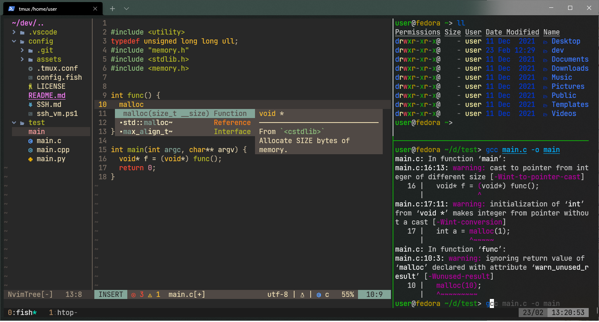

 
Dependencies:
```bash
curl tmux fish exa ranger
util-linux-user # fedora stuff
```

# Install
```bash

```

Notes:
* `[setup of SSH](https://github.com/vadxx/remote-ssh)` from Windows
* `[Neovim is here](https://github.com/vadxx/my-nvim)`
* Set `fish` as default shell:
  ```bash
  chsh -s /usr/bin/fish
  ```


### Keybinds

<table>
<tr> <th>Tmux</th> <th>Fish</th> </tr>
<tr><td>

Keys | Desc
---|---
` + k | kill panel
` + v | split vertical
` + h | split horizontal
  
</td><td>

Keys | Desc
---|---
g | git
ll | exa: list of nodes
la | exa: list of all nodes
lt | exa: tree of nodes
  
</td></tr>
</table>

## Git
```bash
git config user.name <first name and lastname>
git config user.email <your email>
git config --global credential.helper store
# then pull something, git will save your creds after that
```

## Fedora
```bash
# dnf
echo "max_parallel_downloads=10" | sudo tee -a /etc/dnf/dnf.conf
echo "fastestmirror=True" | sudo tee -a /etc/dnf/dnf.conf
```
