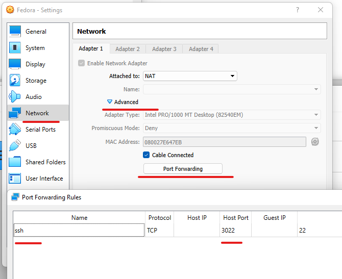

My minimalistic configuration for Unix.  
Install these deps (`sudo dnf install -y`):
```bash
fish exa neovim util-linux-user ripgrep
```
Then run the script:
```bash
curl https://raw.githubusercontent.com/vadxx/config/main/setup.sh | sh
```

# Tmux
The ` is prefix. Added keybinds:
Keys | Desc
---|---
prefix + k | kill panel
prefix + v | split vertical
prefix + h | split horizontal

# Nvim 
Added useful keybind `;` as `:`. Added keybinds:

Keys | Desc
---|---
prefix + t | new tab
prefix + - | split vertical
prefix + \ | split horizontal
visual mode + > | move selected lines right
visual mode + < | move selected lines left

# Fish
Added keybinds:
Keys | Desc
---|---
g | git
ll | exa: list of nodes
la | exa: list of all nodes
lt | exa: tree of nodes

# Core
Configure Fedora and VBox:
```bash
# dnf
echo "max_parallel_downloads=10" | sudo tee -a /etc/dnf/dnf.conf
echo "fastestmirror=True" | sudo tee -a /etc/dnf/dnf.conf
# vbox - share drive G to vm
sudo usermod -aG vboxsf $USER
sudo ln -s /media/sf_G_DRIVE /vm
# enable SSH
systemctl start sshd.service
systemctl enable sshd.service
# optional fonts
curl -fsSL https://raw.githubusercontent.com/JetBrains/JetBrainsMono/master/install_manual.sh | sh
```
Do reboot `systemctl reboot` to enable SSH.

## SSH forward
Open the Settings for your VirtualBox machine and add configuration for forwarding ports as on the screen  
  
Open your Windows powershell and run script:
```powershell
iex (iwr -useb https://raw.githubusercontent.com/vadxx/config/main/ssh_vm.ps1)
```
Usage:
```powershell
ssh vm 
```
# Uninstall
Run the script to remove configs for Neovim, Tmux, Fish:
```bash
curl https://raw.githubusercontent.com/vadxx/config/main/uninstall.sh | sh
```


