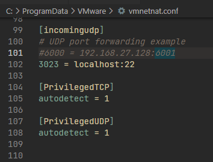

# Overview
Here is a guide how to work with Linux VM from Windows host.

## Prepare your Linux VM
```bash
# make sure that you have 'openssh-server' installed
systemctl start sshd.service
systemctl enable sshd.service
```

## SSH forward
#### VirtualBox
Open the Settings for your VirtualBox VM and add configuration for forwarding ports as on the screen  


#### VMware
Open `C:\ProgramData\VMware\vmnetnat.conf` using text editor and paste it here:  
  
Example: `3023 = 192.168.27.128:22`
```powershell
# then run it from windows as admin:
net stop "VMWare NAT Service"
net start "VMWare NAT Service"
```

## Open your Windows powershell and run script:
```powershell
# run this as admin first:
Set-ExecutionPolicy -ExecutionPolicy RemoteSigned
iwr https://raw.githubusercontent.com/vad56/config/main/ssh_vm.ps1 -out ssh.ps1;
# 1 - alias on Windows; 2 - login on VM; 3 - IP of VM; 4 - port of VM;
.\ssh.ps1 ubuntu-vm user localhost 3022
```
Usage:
```powershell
ssh vm 
```

## Clipboard over SSH
If you need to copy/paste text from NVIM while SSH session from Windows:  

Install the `Windows Terminal` and use `y` to copy selected text.  
Read more [details here](https://github.com/ojroques/vim-oscyank).

## Shortcut to media drive from Windows
```bash
sudo ln -s /media/sf_D_DRIVE /vm
```
